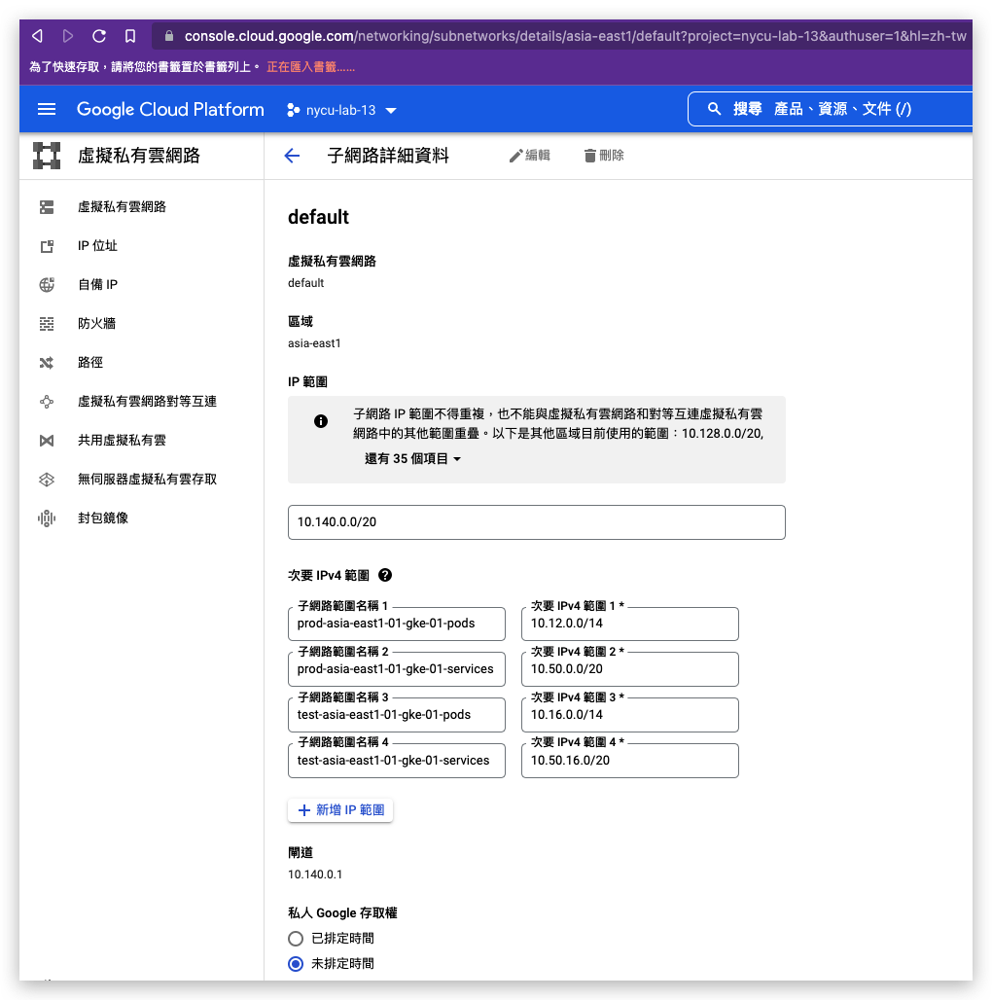

# terragrunt-gke

## 簡介

這是一個自動化建立 gke infra 的酷東西, 以下省略

## 如何使用

1. 先設定 VPC subnet 資訊, 設定規則可參考 [alias-ips](https://cloud.google.com/kubernetes-engine/docs/concepts/alias-ips), 圖示為參考
   

2. 安裝 [gcloud CLI](https://cloud.google.com/sdk/docs/install) 和 [terraform](https://www.terraform.io/downloads) 以及 [terragrunt](https://terragrunt.gruntwork.io/docs/getting-started/install/)
3. 使用以下指令登入 gcloud

    ```sh
    gcloud auth application-default login
    ```

4. 移動到欲建立之環境資料夾後, 查看建立計畫與確認, 然後部署它

    ```sh
    cd prod/gke
    terragrunt plan
    terragrunt apply
    ```
